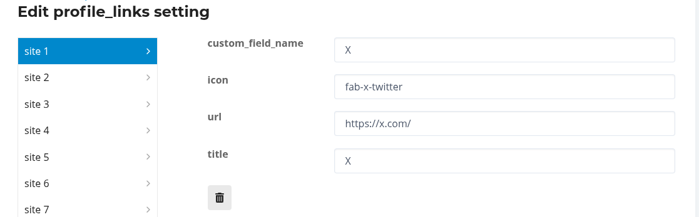

# normalized-profile-links

**Add Links to User Profile and User Card**

Official [Custom Profile Link](https://meta.discourse.org/t/custom-profile-link/295470) adds a link for only one custom field.

[Multiple Custom Profile Links](https://meta.discourse.org/t/multiple-custom-profile-links/295547) is similar to this, but this adds some error checking/fixing of users adding semi-bogus entries.

For example, a user might enter any of these for a Twitter (X):

- https://x.com/MyHandle
- https://twitter.com/MyHandle
- https://www.twitter.com/MyHandle
- x.com/MyHandle
- twitter.com/MyHandle
- /MyHandle
- @MyHandle
- MyHandle

This theme component will make all of those become "MyHandle", so if a user enters any of those in the twitter field, the link will become `https://x.com/MyHandle`.

Settings allow adding any kind of site you wish:

If you require additional [Font Awesome Icons](https://fontawesome.com/v6/search?o=r&m=free) you can add them to the Additional Icons setting.

## Configuration

This theme component adds these links to the user card and user profile page, so you should un-check the "show on user card" (or profile) checkbox in the custom field setting, otherwise, the link will display twice (once by the profile and once by Discourse).

For sites like Youtube and TikTok that require a @ in the profile URL, include the @ at the end of the URL in the theme settings. The @ gets stripped from the username, so it needs to be included in the URL. BlueSky profiles, which are often referred to as `@handle` resolve to `https://bsky.app/profile/handle` (no `@` in the URL), so this peculiarity is required to have a system that works for both of these cases.

If the theme settings for a site include an icon, the site Title is not displayed. A feature that could be added would add a theme setting to display the title even if an icon exists.

A bunch of the sample settings are provided by AI completion and not tested. You can make changes to the settings yourself, but if you let me know about a broken one (via email or PR) I will be happy to fix it.

Another feature I have considered is making it possible to have entries appear on only the User Card or User Profile, rather than both. If that's of interest, please let me know, especially if you have a budget.

Thanks to [Grey Arrows Drone Club](https://greyarro.ws/) for funding initial development!
